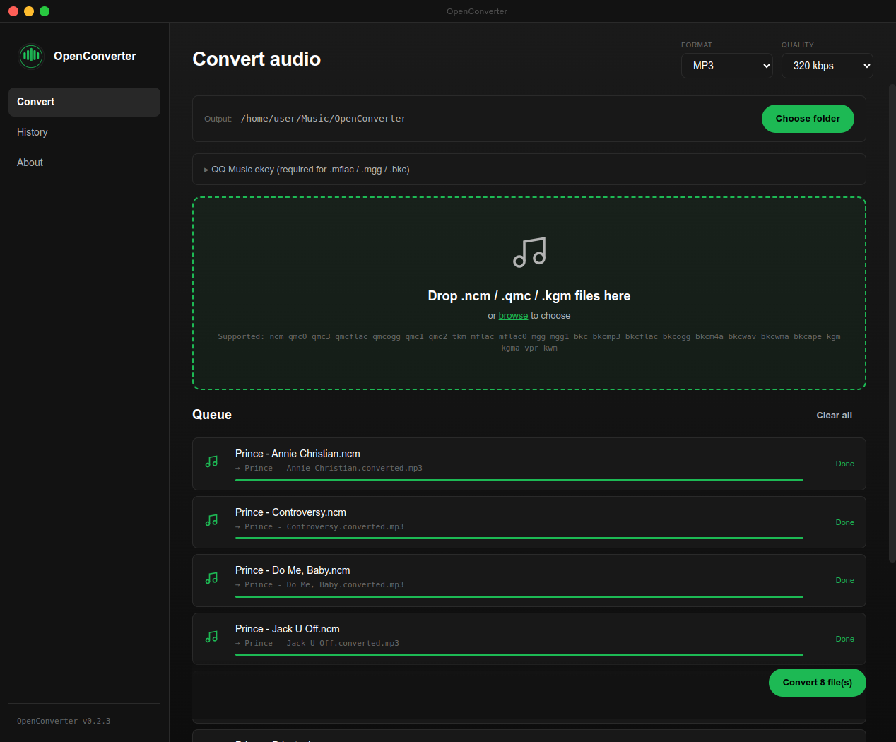
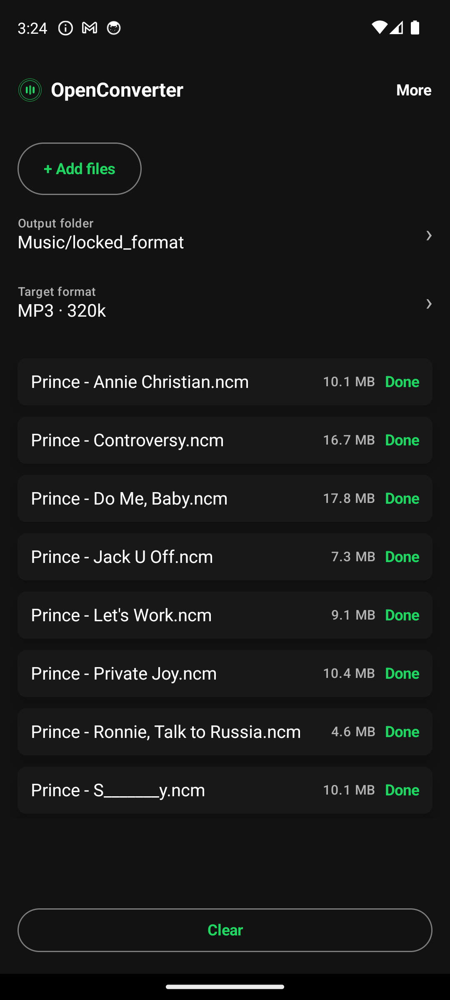
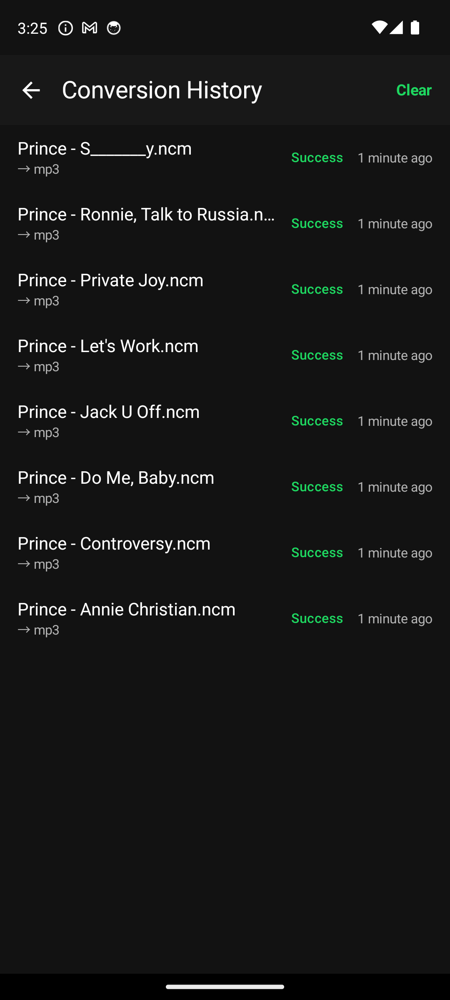

<div align="center">

# OpenConverter

### 跨平台轻量级音频格式转换与本地解码工具链

[English](./README_EN.md) | 简体中文

<p align="center">
面向音频工作流的轻量级格式转换与解密工具。<br/>
<b>桌面端</b>基于 JavaScript 解码管线 + Electron + FFmpeg 转码后端构建；<br/>
<b>Android 端</b>基于 Jetpack Compose + 纯 Kotlin 解码器 + FFmpegKit 架构实现。
</p>

[](#desktop-安装)
[](#desktop-安装)
[](#android-安装)
[](LICENSE)

</div>

---

## 项目介绍

* **隐私至上，完全离线**：所有的解密、转码与处理均完全在本地设备上运行。不上传任何音频数据，零网络交互，安全可靠。
* **真实音频转码 (FFmpeg)**：并非简单重命名或提取，内置 FFmpeg / FFmpegKit 转码后端，支持转码为 MP3 / FLAC / WAV / M4A / OGG，并可根据需要自由选择输出码率（如 320k, 256k 等）。
---

## 界面预览

### 桌面端应用界面
<p align="center">
  
</p>

### Android 移动端应用界面
<p align="center">
  
  &nbsp;&nbsp;
  
  &nbsp;&nbsp;
</p>

---

## 支持的加密格式

| 格式扩展名 | 对应来源平台 |
|:---|:---|
| `.ncm` | 网易云音乐 |
| `.kwm` | 酷我音乐 |
| `.kgm` / `.kgma` / `.vpr` 等 | 酷狗音乐 |
| `.mgg` / `.mgg1` / `.bkc` 等 | QQ音乐 |
| `.mp3` / `.flac` / `.wav` 等明文音频 | 任何平台 |

---

## 安装指南

### Desktop 安装

从 [Releases 页面](https://github.com/nowa277/OpenConverter/releases) 下载对应系统的最新安装包：

#### Debian / Ubuntu
```bash
# AppImage 安装与运行（推荐）
chmod +x openconverter-v***-linux-x64.AppImage
./openconverter-v***-linux-x64.AppImage

# Deb包安装 (注意：OpenConverter 在 Linux 下需要系统 PATH 存在 ffmpeg)
sudo apt install ffmpeg
sudo apt install ./openconverter-v***-linux-amd64.deb
```

#### Windows
* **便携版（推荐）**：`openconverter-v***-windows-x64-portable.exe`
  双击直接运行，可随身携带。
* **NSIS 安装包**：`openconverter-v***-windows-x64-setup.exe`
  双击根据向导安装。
* *提示：Windows 端已内置 `ffmpeg.exe` 与 `ffprobe.exe`，无需手动安装 FFmpeg。首次启动若弹出 Windows Defender 未签名提示，点击“更多信息” -> “仍要运行”即可。*

---

### Android 安装

从 [Releases 页面](https://github.com/nowa277/OpenConverter/releases) 下载最新的 APK 文件安装：

* **arm64-v8a**：`openconverter-v***-android-arm64-v8a.apk` (推荐，适合绝大多数现代智能手机)
* **x86_64**：`openconverter-v***-android-x86_64.apk` (适合在 Android 模拟器上运行与调试)

---

## 源码编译开发

如果你需要从源码构建本项目，请确保您的计算机上配置了 Node.js 18+ 与 Android SDK（如果编译 Android 版本）。

### 编译桌面端 (Electron)
```bash
# 安装依赖
npm install

# 编译前端静态资源
npm run build:renderer

# 编译 Linux 软件包 (AppImage/Deb)
npm run build:linux

# 编译 Windows 软件包 (需要 wine64 环境)
npm run build:win
```

### 编译 Android 端
```bash
cd android

# 运行本地单元测试
./gradlew :app:test

# 编译并打包 Debug/Release APK
./gradlew :app:assembleRelease
```

---

## 免责声明

本项目仅作为个人音频学习、文件格式整理及兼容性研究的技术工具使用，不涉及任何版权音频内容的提供、分发或存储。使用者在使用过程中应严格遵守相关法律法规，尊重音乐作品著作权人的合法权益，不得将本工具用于任何侵犯著作权的行为。由于使用本工具引发的任何法律争议或纠纷，均由使用者自行承担，与本项目作者及贡献者无关。

---

## 开源许可证

本项目基于 [Apache License 2.0](./LICENSE) 协议开源。
