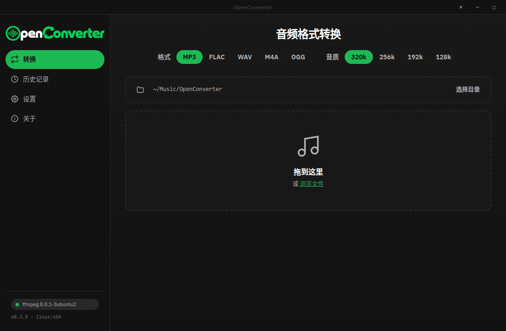
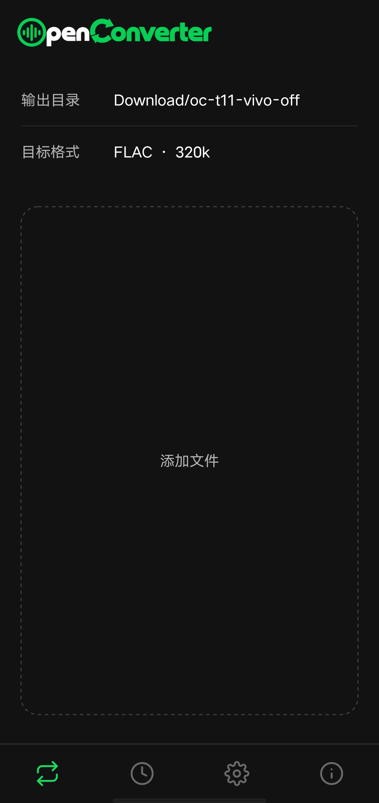

<div align="center">

# OpenConverter

### 跨平台轻量级音频格式转换与本地解码工具链

[English](./README_EN.md) | 简体中文

<p align="center">
面向音频工作流的轻量级格式转换与解密工具。<br/>
<b>桌面端</b>基于 JavaScript 解码管线 + Electron + FFmpeg 转码后端构建；<br/>
<b>Android 端</b>基于 Jetpack Compose + 纯 Kotlin 解码器 + FFmpegKit 架构实现。
</p>

[](#desktop-安装)
[](#desktop-安装)
[](#android-安装)
[](LICENSE)

<p align="center">
  <picture>
    <source media="(prefers-color-scheme: dark)" srcset="assets/brand-wordmark.png">
    
  </picture>
</p>

</div>

---

## 项目介绍

* **隐私至上**：解密与转码在本机完成。网易云歌词默认按歌曲 id 请求（设置里可关）。不上传音频。
* **真实转码**：内置 FFmpeg / FFmpegKit。桌面端输出 MP3 / FLAC / WAV / M4A / OGG；手机端输出 MP3 / FLAC / WAV / M4A。

### 桌面端 0.3.9
* 侧栏是品牌艺术字。格式和音质在转换页，队列左滑删除。
* 网易云歌曲写入曲名、歌手、专辑和封面，并默认写入歌词。临时失败会重试。找不到歌词不影响转码。
* 加密文件按块解密。酷狗 `.kgg` 可扫描或导入密钥；QQ 音乐 `.mgg` / `.mflac` 在设置里填写 ekey。

### 手机端 1.4.4
* 底部是四个静止图标。转换页是输出目录、目标格式和添加区域，队列左滑删除。
* 关于页可以检查并安装更新。
* 网易云歌曲写入曲名、歌手、专辑、封面和歌词。找不到歌词不影响转码。
* 加密文件按块解密。酷狗 `.kgg` 可在设置里同步、自动查找或导入密钥。

---

## 界面预览

<p align="center">
  
</p>

<p align="center">
  
</p>

---

## 支持的加密格式

| 格式扩展名 | 对应来源平台 |
|:---|:---|
| `.ncm` | 网易云音乐 |
| `.kwm` | 酷我音乐 |
| `.kgm` / `.kgma` / `.vpr` 等 | 酷狗音乐 |
| `.kgg` / `.kgg.flac` | 酷狗音乐（v5：桌面端支持全盘自动扫描/导入；Android 端支持原生 Root 同步、公共目录扫描及在设置中导入 `kgg.key` / `KGMusicV3.db`） |
| `.mgg` / `.mgg1` / `.bkc` 等 | QQ 音乐（在设置里填写一次 ekey） |
| `.mp3` / `.flac` / `.wav` 等明文音频 | 任何平台 |

---

## 安装指南

### Desktop 安装

从 [Releases 页面](https://github.com/nowa277/OpenConverter/releases) 下载对应系统的最新安装包：

#### Debian / Ubuntu
```bash
# AppImage 安装与运行（推荐）
chmod +x openconverter-v0.3.9-linux-x64.AppImage
./openconverter-v0.3.9-linux-x64.AppImage

# Deb 包安装（Linux 需要系统里已有 ffmpeg）
sudo apt install ffmpeg
sudo apt install ./openconverter-v0.3.9-linux-amd64.deb
```

#### Windows
* **便携版（推荐）**：`openconverter-v0.3.9-windows-x64-portable.exe`
  双击直接运行，可随身携带。
* **NSIS 安装包**：`openconverter-v0.3.9-windows-x64-setup.exe`
  双击根据向导安装。
* *提示：Windows 端已内置 `ffmpeg.exe` 与 `ffprobe.exe`，无需手动安装 FFmpeg。首次启动若弹出 Windows Defender 未签名提示，点击“更多信息” -> “仍要运行”即可。*

---

### Android 安装

从 [Releases 页面](https://github.com/nowa277/OpenConverter/releases) 下载最新的 APK 文件安装：

* **arm64-v8a**：`openconverter-v1.4.4-android-arm64-v8a.apk` (推荐，适合绝大多数现代智能手机)
* **x86_64**：`openconverter-v1.4.4-android-x86_64.apk` (适合在 Android 模拟器上运行与调试)

酷狗 `.kgg` 需要对应歌曲的密钥，只保存在本机：
1. **已 Root**：设置里打开「自动同步」，或点「同步密钥」。
2. **未 Root**：把 `kgg.key` 或 `KGMusicV3.db` 放到「下载」或「音乐」，或在设置里点「导入」。

> [!IMPORTANT]
> **Android 端 KGG 解密策略指南：**
> 1. **已 Root**：设置里点「同步密钥」，或打开「自动同步」。
> 2. **未 Root 设备**：把电脑上的 `KGMusicV3.db`（Windows 上通常在 `C:\Users\Public\KuGou\KGMusic\KGMusicV3.db`）或 `kgg.key` 放到手机「下载」或「音乐」，或在设置里点「导入」。
> 3. **降级方案（可选）**：将手机酷狗音乐降级至早期版本，下载的文件格式为 `.kgm` / `.kgma`，此类格式完全免 Root、免导入，可在 OpenConverter 中直接批量转换。

| 格式后缀 | 对应版本及音质 | 手机端解密是否需要密钥数据库？ | 结论与使用建议 |
| :--- | :--- | :--- | :--- |
| **`.kgm`** | 早期格式，标准或高品质 MP3 | ❌ 不需要 (免 Root / 免导入) | 完全可解。可直接在手机版 OpenConverter 中进行一键转换。 |
| **`.kgma`** | 早期格式，超高品质或无损 FLAC | ❌ 不需要 (免 Root / 免导入) | 完全可解。可直接在手机版 OpenConverter 中进行一键转换。 |
| **`.vpr`** | 酷狗彩铃格式 | ❌ 不需要 (免 Root / 免导入) | 完全可解。可直接在手机版 OpenConverter 中进行一键转换。 |
| **`.kgg`** | 现代格式，酷狗专属加密 | ⚠️ 需要逐曲密钥 | 已支持。Root 设备一键直接提取；未 Root 设备可放 `kgg.key` / `KGMusicV3.db` 于公共目录或设置中导入。 |
| **`.kgg.flac`** | 现代格式，酷狗无损加密 | ⚠️ 需要逐曲密钥 | 已支持。Root 设备一键直接提取；未 Root 设备可放 `kgg.key` / `KGMusicV3.db` 于公共目录或设置中导入。 |


  ---

## 源码编译开发

如果你需要从源码构建本项目，请确保您的计算机上配置了 Node.js 18+ 与 Android SDK（如果编译 Android 版本）。

### 编译桌面端 (Electron)
```bash
# 安装依赖
npm install

# 编译前端静态资源
npm run build:renderer

# 编译 Linux 软件包 (AppImage/Deb)
npm run build:linux

# 编译 Windows 软件包 (需要 wine64 环境)
npm run build:win
```

### 编译 Android 端
```bash
cd android

# 运行本地单元测试
./gradlew testDebugUnitTest connectedDebugAndroidTest

# 编译并打包 Debug/Release APK
./gradlew :app:assembleRelease
```

真实 KGG 样本不会进入仓库。维护者可在已启动的 Android 设备或模拟器上运行环境门控的逐字节等价验证：

```bash
KGG_FIXTURE_DIR=/local/kgg \
KGG_KEY_SOURCE=/local/KGMusicV3.db \
KGG_EXPECTED_DIR=/local/reference \
android/scripts/verify-kgg-v5.sh
```

`reference` 必须是同一批输入经独立参考实现解密得到的明文目录，保持相同相对路径并使用真实容器扩展名。脚本只暂存本地材料用于测试，结束后自动清理设备和主机临时文件。

---

## 免责声明

本项目仅作为个人音频学习、文件格式整理及兼容性研究的技术工具使用，不涉及任何版权音频内容的提供、分发或存储。使用者在使用过程中应严格遵守相关法律法规，尊重音乐作品著作权人的合法权益，不得将本工具用于任何侵犯著作权的行为。由于使用本工具引发的任何法律争议或纠纷，均由使用者自行承担，与本项目作者及贡献者无关。

---

## 开源许可证

本项目基于 [Apache License 2.0](./LICENSE) 协议开源。
