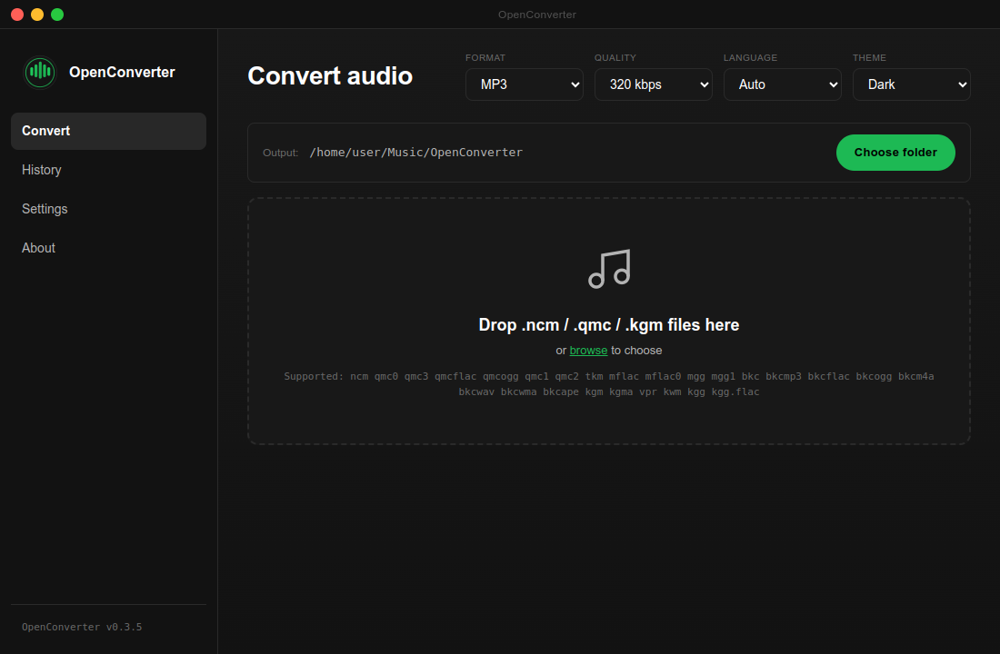
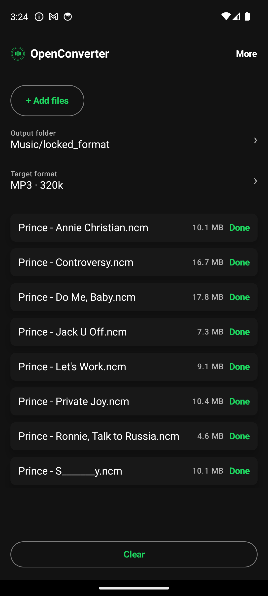
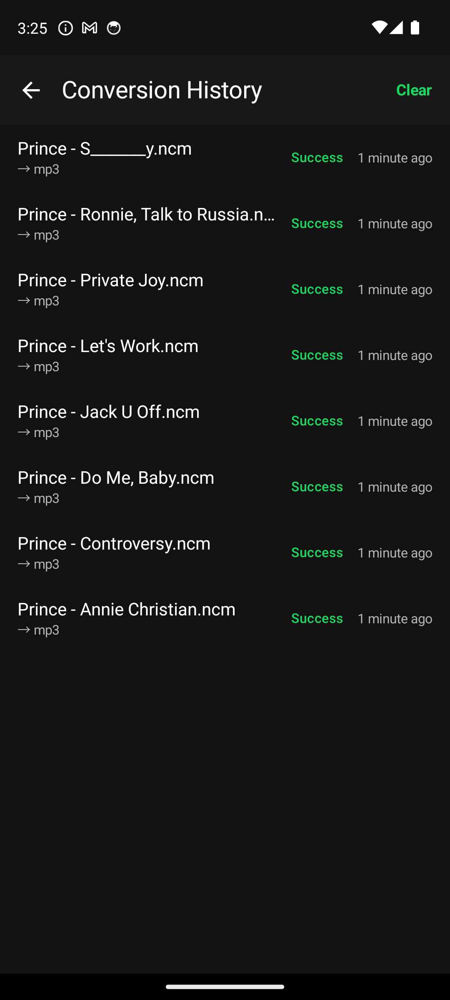
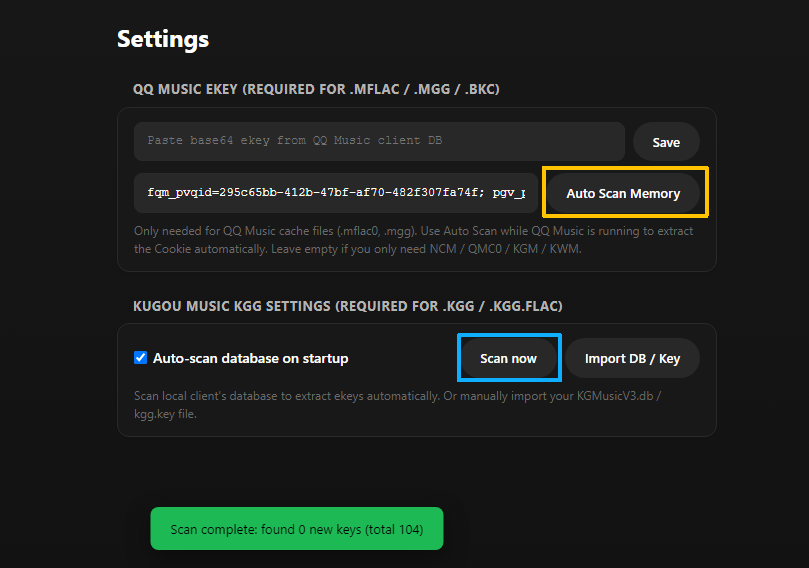
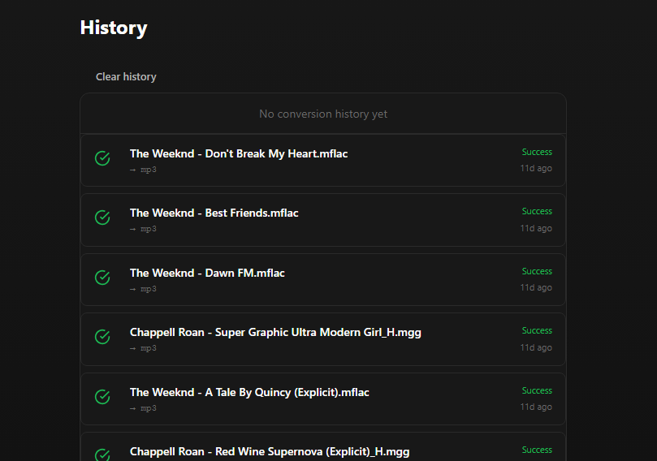

<div align="center">

# OpenConverter

### Cross-platform lightweight audio format converter and local decoding toolchain

English | [简体中文](./README.md)

<p align="center">
A lightweight format conversion and decryption tool for audio workflows.<br/>
<b>Desktop client</b> built with JavaScript decoding pipeline + Electron + FFmpeg transcoding backend;<br/>
<b>Android client</b> implemented with Jetpack Compose + pure Kotlin decoders + FFmpegKit architecture.
</p>

[](#desktop-installation)
[](#desktop-installation)
[](#android-installation)
[](LICENSE)

</div>

---

## Project Highlights

* **Privacy First, Fully Offline**: All decryption, transcoding, and processing run completely on the local device. No audio data is uploaded, zero network interaction, safe and secure.
* **True Audio Transcoding (FFmpeg)**: Not a simple rename or extraction. Built-in FFmpeg / FFmpegKit transcoding backend supports converting to MP3, FLAC, WAV, M4A, and OGG, with customizable output bitrates (e.g., 320 kbps, 256 kbps, etc.).

---

## UI Preview

### Desktop Application UI
<p align="center">
  
</p>

### Android Mobile UI
<p align="center">
  
  &nbsp;&nbsp;
  
  &nbsp;&nbsp;
</p>

---

## Supported Encrypted Formats

| Extension | Source Platform | Decryption Method & Requirements |
|:---|:---|:---|
| `.ncm` | NetEase Cloud Music | Direct decryption via local algorithm |
| `.kwm` | KuWo Music | Direct decryption via local algorithm |
| `.kgm` / `.kgma` / `.vpr` | KuGou Music / Viper | Direct decryption via local algorithm |
| `.kgg` / `.kgg.flac` | KuGou Music | On Android, import a matching `KGMusicV3.db` or `kgg.key` in Settings |
| `.mgg` / `.mgg1` / `.bkc` | QQ Music | Requires configuring the **ekey** once in **Settings/More** (a base64 string extracted from the local QQ Music client database), which the app persists via secure storage |
| `.mp3` / `.flac` / `.wav` | Any Platform | Import directly for general format or bitrate transcoding |

---

## Installation Guide

### Desktop Installation

Download the latest installer package for your operating system from the [Releases page](https://github.com/nowa277/OpenConverter/releases):

#### Debian / Ubuntu
```bash
# AppImage installation and execution (Recommended)
chmod +x release/openconverter-v***-linux-x64.AppImage
./release/openconverter-v***-linux-x64.AppImage

# Deb package installation (Note: OpenConverter on Linux requires ffmpeg in the system PATH)
sudo apt install ffmpeg
sudo dpkg -i release/openconverter-v***-linux-amd64.deb
sudo apt install -f  # Fix potentially missing dependencies
openconverter
```

#### Windows
* **Portable Version (Recommended)**: `openconverter-v***-windows-x64-portable.exe`
  Double-click to run directly, portable.
* **NSIS Installer**: `openconverter-v***-windows-x64-setup.exe`
  Double-click to install via wizard.
* *Note: The Windows client has built-in `ffmpeg.exe` and `ffprobe.exe`, so no manual FFmpeg installation is required. If the Windows Defender unsigned prompt pops up on first launch, click "More info" -> "Run anyway".*

---

### Android Installation

Download the latest APK files from the [Releases page](https://github.com/nowa277/OpenConverter/releases) to install:

* **arm64-v8a**: `openconverter-v***-android-arm64-v8a.apk` (Recommended, suitable for the vast majority of modern smartphones)
* **x86_64**: `openconverter-v***-android-x86_64.apk` (Suitable for running and debugging on Android Emulators)

KGG v5 uses per-file keys. On Android, use the system document picker in Settings to import `KGMusicV3.db` from your own KuGou environment, or a portable `kgg.key`. Mappings are merged only inside the app sandbox on that device; the project does not bundle, upload, or query databases, accounts, or keys online.

### Auto Key Fetch Guide and Success Demo
Supports one-click automatic key acquisition for KuGou and QQ Music formats. In the "Settings" page, you can automatically scan memory to get the QQ Music Cookie and fetch decryption info. KuGou Music also supports one-click full-disk automatic key scanning:
<p align="center">
  
</p>

Once successfully configured, you can simply drag and drop encrypted files for fully automated batch decryption and conversion:
<p align="center">
  
</p>

> [!IMPORTANT]
> **Android KGG Decryption Limits & Workarounds:**
> 1. **System Sandbox Restrictions**: On non-rooted phones, Android's security model strictly prohibits any application (including this app and ADB shell) from directly reading KuGou's private database `kugou_music_v2.db`. Therefore, automatic local key scanning is unavailable on Android.
> 2. **Rootless Alternatives**:
>    * **PC Database Transfer**: If you use KuGou on PC, you can copy its database file `KGMusicV3.db` (e.g. at `C:\Users\Public\KuGou\KGMusic\KGMusicV3.db` on Windows) to your phone's public folder (like `Download`), and then import it via the Settings page. Once imported, keys are merged into the app sandbox, enabling you to decrypt these KGG files locally forever.
>    * **App Downgrade (Recommended)**: Downgrade the KuGou Music app on your phone to an older version. Older versions download files in `.kgm` or `.kgma` formats, which use algorithm-derived keys and do not require database lookups. OpenConverter on Android can decrypt `.kgm`/`.kgma` files directly without root or any database imports.

---

## Build and Development

If you need to build the project from source, please ensure Node.js 18+ and Android SDK (for compiling the Android version) are configured on your computer.

### Compile Desktop Client (Electron)
```bash
# Install dependencies
npm install

# Compile frontend static assets
npm run build:renderer

# Package Linux binaries (AppImage/Deb)
npm run build:linux

# Package Windows binaries (requires wine64 environment)
npm run build:win
```

### Compile Android Client
```bash
cd android

# Run local unit tests
./gradlew testDebugUnitTest connectedDebugAndroidTest

# Compile and package Debug/Release APK
./gradlew :app:assembleRelease
```

Real KGG fixtures are not committed. Maintainers can run the environment-gated byte-equivalence check on a booted Android device or emulator:

```bash
KGG_FIXTURE_DIR=/local/kgg \
KGG_KEY_SOURCE=/local/KGMusicV3.db \
KGG_EXPECTED_DIR=/local/reference \
android/scripts/verify-kgg-v5.sh
```

`reference` must contain plaintext produced from the same inputs by an independent reference implementation, preserving relative paths and using the actual container extension. The script stages private material only for the test and removes host/device staging on exit.

---

## Disclaimer

This project is intended solely as a technical tool for personal audio learning, file format organization, and compatibility research. It does not provide, distribute, or store any copyrighted audio content. Users must strictly abide by relevant laws and regulations, respect the legitimate rights of music copyright holders, and must not use this tool for any copyright-infringing behaviors. Any legal disputes or controversies arising from the use of this tool shall be borne by the user, and have no association with the authors and contributors of this project.

---

## License

This project is open-source under the [Apache License 2.0](./LICENSE) agreement.
