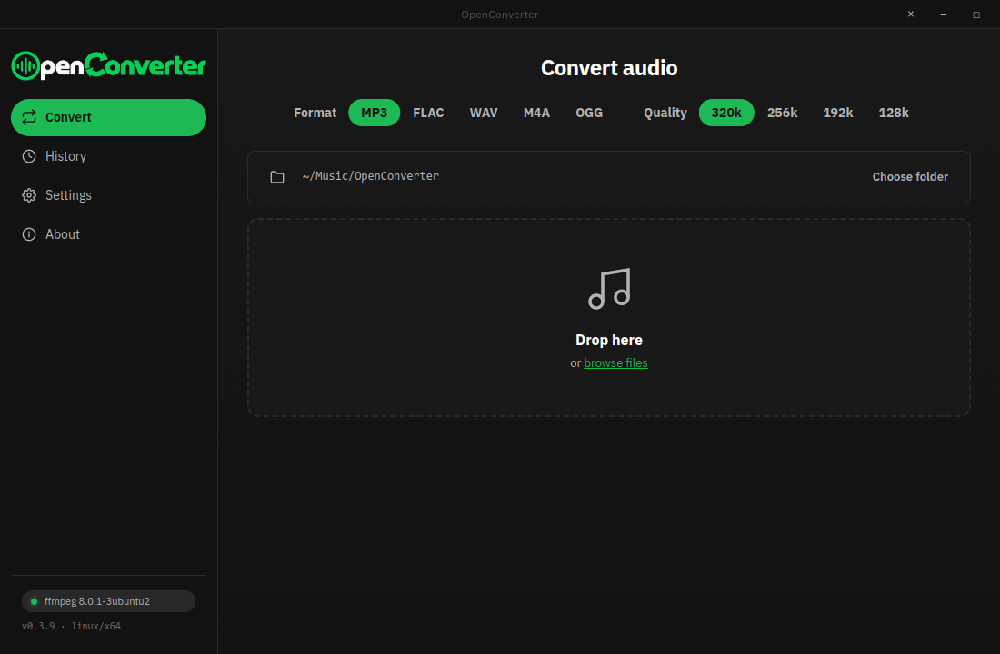
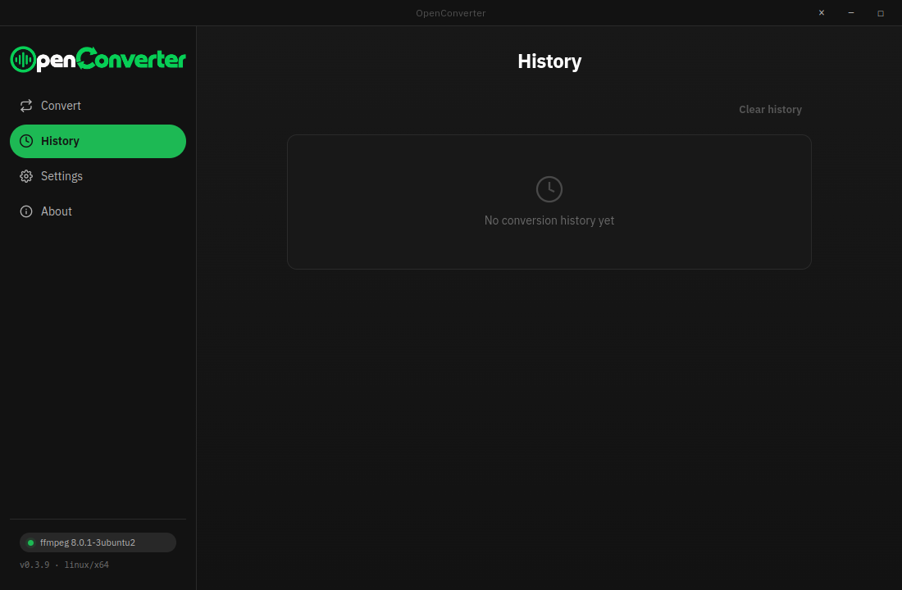
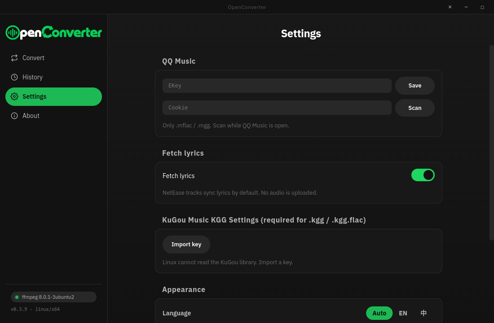
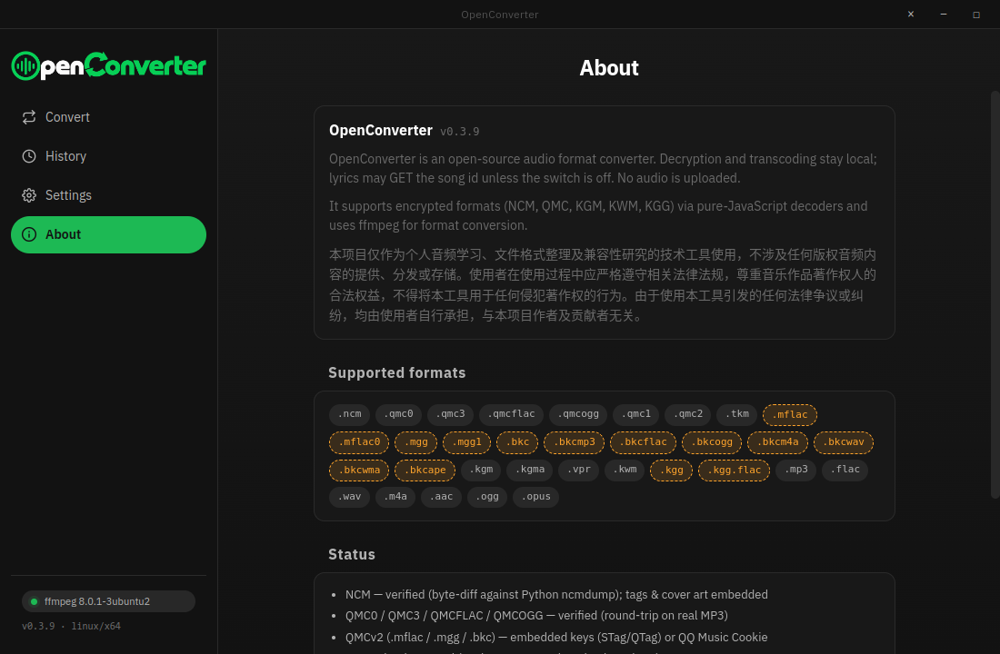
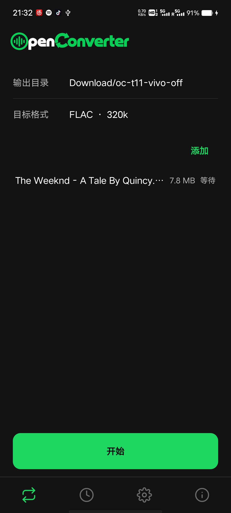
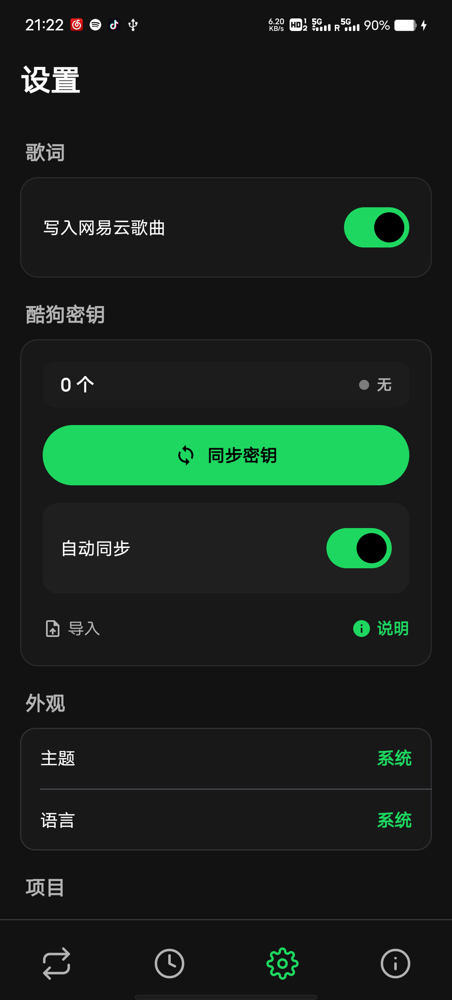
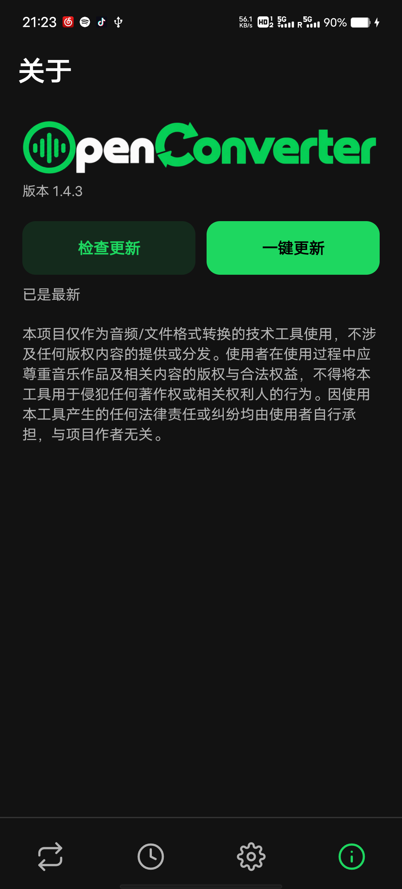

<div align="center">

# OpenConverter

### Cross-platform lightweight audio format converter and local decoding toolchain

English | [简体中文](./README.md)

<p align="center">
A lightweight format conversion and decryption tool for audio workflows.<br/>
<b>Desktop client</b> built with JavaScript decoding pipeline + Electron + FFmpeg transcoding backend;<br/>
<b>Android client</b> implemented with Jetpack Compose + pure Kotlin decoders + FFmpegKit architecture.
</p>

[](#desktop-installation)
[](#desktop-installation)
[](#android-installation)
[](LICENSE)

<p align="center">
  <picture>
    <source media="(prefers-color-scheme: dark)" srcset="assets/brand-wordmark.png">
    
  </picture>
</p>

</div>

---

## Project Highlights

* **Private by default**: decryption and transcoding stay on the device. NetEase lyrics request a song id unless that switch is off. No audio is uploaded.
* **Real transcoding**: FFmpeg on desktop, FFmpegKit on Android. Desktop writes MP3 / FLAC / WAV / M4A / OGG. Android writes MP3 / FLAC / WAV / M4A.

### Desktop 0.3.9
* The sidebar is the brand wordmark. Format and quality sit on the convert page. Swipe a queue row left to remove it.
* NetEase tracks keep title, artist, album, and cover, and lyrics are written by default. A transient miss is retried. A missing lyric does not fail the conversion.
* Cipher files are decrypted in chunks. KuGou `.kgg` can be scanned or imported. QQ Music `.mgg` / `.mflac` uses an ekey entered in Settings.

### Android 1.4.4
* Four static icons sit on the bottom bar. The convert page is the output folder, the target format, and an add area. Swipe a queue row left to remove it.
* About can check for an update and open the installer.
* NetEase tracks keep title, artist, album, cover, and lyrics. A missing lyric does not fail the conversion.
* Cipher files are decrypted in chunks. KuGou `.kgg` keys can be synced, found automatically, or imported from Settings.

---

## UI Preview

<p align="center">
  
  <br>
  
  <br>
  
  
  
  
</p>

---

## Supported Encrypted Formats

| Extension | Source Platform | Decryption Method & Requirements |
|:---|:---|:---|
| `.ncm` | NetEase Cloud Music | Direct decryption via local algorithm |
| `.kwm` | KuWo Music | Direct decryption via local algorithm |
| `.kgm` / `.kgma` / `.vpr` | KuGou Music / Viper | Direct decryption via local algorithm |
| `.kgg` / `.kgg.flac` | KuGou Music | Desktop auto-scans disks; Android supports Native Root sync, public storage scanning, and manual import of `kgg.key` / `KGMusicV3.db` |
| `.mgg` / `.mgg1` / `.bkc` | QQ Music | Needs an ekey pasted once in Settings |
| `.mp3` / `.flac` / `.wav` | Any Platform | Import directly for general format or bitrate transcoding |

---

## Installation Guide

### Desktop Installation

Download the latest installer package for your operating system from the [Releases page](https://github.com/nowa277/OpenConverter/releases):

#### Debian / Ubuntu
```bash
# AppImage installation and execution (Recommended)
chmod +x openconverter-v0.3.9-linux-x64.AppImage
./openconverter-v0.3.9-linux-x64.AppImage

# Deb package (Linux needs ffmpeg on PATH)
sudo apt install ffmpeg
sudo apt install ./openconverter-v0.3.9-linux-amd64.deb
sudo apt install -f  # Fix potentially missing dependencies
openconverter
```

#### Windows
* **Portable (recommended)**: `openconverter-v0.3.9-windows-x64-portable.exe`
  Double-click to run. Nothing to install.
* **NSIS installer**: `openconverter-v0.3.9-windows-x64-setup.exe`
  Double-click to install via wizard.
* *Note: The Windows client has built-in `ffmpeg.exe` and `ffprobe.exe`, so no manual FFmpeg installation is required. If the Windows Defender unsigned prompt pops up on first launch, click "More info" -> "Run anyway".*

---

### Android Installation

Download the latest APK files from the [Releases page](https://github.com/nowa277/OpenConverter/releases) to install:

* **arm64-v8a**: `openconverter-v1.4.4-android-arm64-v8a.apk` (Recommended, suitable for the vast majority of modern smartphones)
* **x86_64**: `openconverter-v1.4.4-android-x86_64.apk` (Suitable for running and debugging on Android Emulators)

KuGou `.kgg` needs a per-track key. Keys stay on the phone:
1. **Rooted**: turn on Auto sync, or tap Sync keys.
2. **Not rooted**: put `kgg.key` or `KGMusicV3.db` in Download or Music, or tap Import in Settings.

> [!IMPORTANT]
> **Android KGG Decryption Guide:**
> 1. **Rooted Phones**: One-tap Native Root sync in Settings unlocks all downloaded KGG tracks immediately.
> 2. **Not rooted**: copy `KGMusicV3.db` (on Windows, often `C:\Users\Public\KuGou\KGMusic\KGMusicV3.db`) or `kgg.key` into Download or Music, or tap Import in Settings.
> 3. **Downgrade Alternative**: Older KuGou versions download tracks as `.kgm` / `.kgma` without database requirements, allowing instant decryption without root or imports.

---

## Build and Development

If you need to build the project from source, please ensure Node.js 18+ and Android SDK (for compiling the Android version) are configured on your computer.

### Compile Desktop Client (Electron)
```bash
# Install dependencies
npm install

# Compile frontend static assets
npm run build:renderer

# Package Linux binaries (AppImage/Deb)
npm run build:linux

# Package Windows binaries (requires wine64 environment)
npm run build:win
```

### Compile Android Client
```bash
cd android

# Run local unit tests
./gradlew testDebugUnitTest connectedDebugAndroidTest

# Compile and package Debug/Release APK
./gradlew :app:assembleRelease
```

Real KGG fixtures are not committed. Maintainers can run the environment-gated byte-equivalence check on a booted Android device or emulator:

```bash
KGG_FIXTURE_DIR=/local/kgg \
KGG_KEY_SOURCE=/local/KGMusicV3.db \
KGG_EXPECTED_DIR=/local/reference \
android/scripts/verify-kgg-v5.sh
```

`reference` must contain plaintext produced from the same inputs by an independent reference implementation, preserving relative paths and using the actual container extension. The script stages private material only for the test and removes host/device staging on exit.

---

## Disclaimer

This project is intended solely as a technical tool for personal audio learning, file format organization, and compatibility research. It does not provide, distribute, or store any copyrighted audio content. Users must strictly abide by relevant laws and regulations, respect the legitimate rights of music copyright holders, and must not use this tool for any copyright-infringing behaviors. Any legal disputes or controversies arising from the use of this tool shall be borne by the user, and have no association with the authors and contributors of this project.

---

## License

This project is open-source under the [Apache License 2.0](./LICENSE) agreement.
