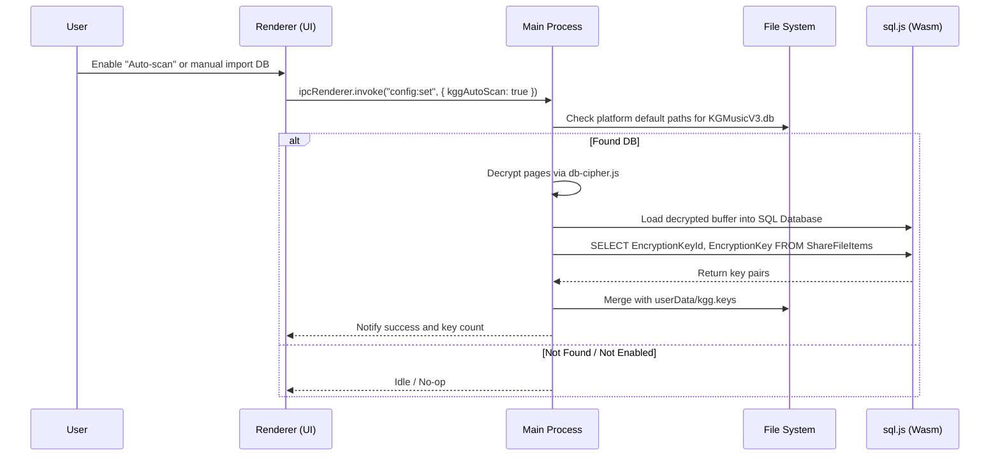

# Spec: KuGou KGG v5 and QMC/BKC Integration

This document outlines the detailed design for integrating KuGou's KGG v5 database deciphering (`KGMusicV3.db`), automatic key scanning, UI setting controls, Android root instructions, and BKC/QMC sniffing variants into OpenConverter.

## 1. Objectives

- **Wasm SQLite Engine**: Integrate `sql.js` (WebAssembly) to query decrypted SQLite databases on the desktop without relying on native compilation.
- **Persistent Key Store**: Maintain a local key store `userData/kgg.keys` containing mapping pairs of `EncryptionKeyId$EncryptionKey` to resolve `.kgg` files on demand.
- **Auto-Scan Settings Drawer**: Introduce an "Auto-scan database" switch in the Settings UI. When enabled, scan client databases automatically.
- **Robust Sniffing**: Enhance input validation and format sniffing for BKC and KGG file decoders to map extension headers correctly.
- **Android Root Instructions**: Wire a root-user instructions dialogue in Android's key manager.

## 2. Desktop Key Integration Flow

## 3. Detailed Components

### 3.1. Main Process Key Manager (`src/main/kgg-keys.js`)
We will create a helper module in the main process to handle database scanning, decryption, Wasm SQLite parsing, and merging keys:
- **Scan Directories**:
  - **Windows**: `%ALLUSERSPROFILE%\KuGou\KGMusic\KGMusicV3.db` and `%APPDATA%\KuGou\KGMusicV3.db`.
  - **macOS**: `~/Library/Application Support/KuGou/KGMusicV3.db`.
  - **Linux**: Skip database scan (warn user natively unsupported).
- **Merge logic**: Open `userData/kgg.keys`, parse existing maps, merge newly extracted entries, and write back sorted.

### 3.2. WebAssembly SQLite (`sql.js`) Integration
- Add `"sql.js": "^1.12.0"` to dependencies.
- Load `sql.js` asynchronously in the main process helper.
- Instantiate `SQL.Database` with a `Uint8Array` copy of decrypted DB buffers.

### 3.3. Routing & Sniffing Updates
- In `src/main/index.js`, during conversion of `.kgg` or `.kgg.flac`, pass the path `userData/kgg.keys` directly via `opts.keyPath`.
- Add a magic check for `.kgg` files before calling the decoder to immediately intercept mismatched or corrupted inputs.
- Enhance format sniffing (`sniffFormat`) in `src/decoders/kgg/index.js` and `src/decoders/qmc.js` to correctly resolve `.bkcmp3`, `.bkcflac`, and similar dual-extension output formats.

### 3.4. Settings UI & Localization
Modify `src/renderer/index.html` and `src/renderer/main.js` to add:
- A new section under Settings for **KuGou Music KGG Settings**.
- A checkbox for `kggAutoScan` and a button for `Import Key File / DB`.
- Localized hints for Linux users explaining native limitations.
- Localized notifications for import statistics ("Imported X new keys, updated Y keys").

### 3.5. Android Root Instruction Modal
Modify Android settings UI to provide a helper popup/instruction card explaining how to access `/data/data/com.kugou.android/databases/kugou_music_v2.db` if they have a Rooted device or how to backup/export to a visible shared storage path first.

## 4. Verification Plan

### 4.1. Automated Tests
- **`tests/kgg-db-sql.test.js`**: Verify that `sql.js` initializes correctly, query mock database buffers, and extract keys.
- **`tests/kgg-autoscan.test.js`**: Test platform path routing and mock scan operations.

### 4.2. Manual Verification
- Launch electron client in development mode.
- Enable automatic scanning or manually import a mock `KGMusicV3.db` file.
- Verify successful population of `userData/kgg.keys`.
